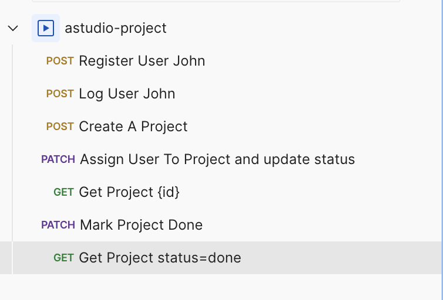

# Project Manager Sample API with Laravel

## Steps to run

Requirements:

-   php and composer installed
-   mysql

Clone the repo and run composer install and npm install

```shell
git clone https://github.com/ouss4m4/astudio.git
cd astudio
composer install
npm install
npm run build
```

copy the `.env.example` to `.env` file and edit the database credentials

Generate a key and Run migrations/seed

```shell
php artisan key:generate
php artisan migrate:fresh --seed
```

Generate a Laravel Passport Personal Access Client

```shell
php artisan passport:keys
php artisan passport:client --personal
```

Start the server

```shell
composer run dev
```

Server should be running on http://127.0.0.1:8000 (check terminal if you encounter port errors)

## API Documentation

### Available Endpoints

#### Authentication

1. POST /api/register

```json
{
    "first_name": "string",
    "last_name": "string",
    "email": "string",
    "password": "string"
}
```

2. POST /api/login

```json
{
    "email": "string",
    "password": "string"
}
```

3. POST /api/logout

#### Projects

1.  GET /api/projects
2.  POST /api/projects

```json
{
    "name": "string",
    "status": "string", // "todo" | "progress" | "done"
    "attributes": [
        {
            "id": "int",
            "value": "string"
        }
    ]
}
```

3.  GET /api/projects/{id}
4.  PATCH /api/projects/{id}

```json
{
    // partial update of project
    "status": "string", // "todo" | "progress" | "done"
    "users": [1] // ids of users
}
```

5.  DELETE /api/projects/{id}

#### Timesheets

1.  GET /api/timesheets
2.  POST /api/timesheets

```json
{
    "user_id": "int",
    "project_id": "int",
    "date": "string",
    "hours": "int",
    "task_name": "string"
}
```

3.  GET /api/timesheets/{id}
4.  PATCH /api/timesheets/{id}
5.  DELETE /api/timesheets/{id}

#### Attributes

1.  GET /api/attributes
2.  POST /api/attributes

```json
{
    "name": "string",
    "type": "string"
}
```

3.  GET /api/attributes/{id}
4.  PATCH /api/attributes/{id}
5.  DELETE /api/attributes/{id}

## API Test Requests

### POSTMAN (recomended)

import the `api-collection.json` in postman
and you should see requests like this



### Curl (optional)

### Register a new user

```bash
curl --silent --location 'http://127.0.0.1:8000/api/register' \
--header 'Content-Type: application/json' \
--data-raw '{
    "first_name": "John",
    "last_name": "Doe",
    "email": "john@gmail.com",
    "password": "johndoe"
}'
```

#### Login and store the token

```bash
export TOKEN=$(curl --silent --location 'http://127.0.0.1:8000/api/login' \
--header 'Content-Type: application/json' \
--data-raw '{
    "email": "john@gmail.com",
    "password": "johndoe"
}' | jq -r '.token')

echo "Token: $TOKEN"
```

#### Create a new project and store the project ID

```bash
export PROJECT_ID=$(curl --silent --location 'http://127.0.0.1:8000/api/projects' \
--header "Authorization: Bearer $TOKEN" \
--header 'Content-Type: application/json' \
--data '{
    "name": "Project X",
    "status": "todo",
    "attributes": [
        {
            "id": 1,
            "value": "Finance"
        },
        {
            "id":2,
            "value": "2025-02-25"
        }
    ]
}' | jq -r '.id')

echo "Project ID: $PROJECT_ID"
```

#### Assign users and update project status

```bash
curl --silent --location --request PATCH "http://127.0.0.1:8000/api/projects/$PROJECT_ID" \
--header "Authorization: Bearer $TOKEN" \
--header 'Content-Type: application/json' \
--data '{
"status": "progress",
"users": [1, 3]
}'
```

#### mark timesheet for a user

```bash
curl --location 'http://127.0.0.1:8000/api/timesheets' \
--header "Authorization: Bearer $TOKEN" \
--header 'Content-Type: application/json' \
--data '{
    "user_id": 1,
    "project_id": 1,
    "date": "2025-02-25",
    "hours": 4,
    "task_name": "Project setup"
}'
```

#### Fetch the updated project

```bash
curl --location 'http://127.0.0.1:8000/api/projects/'"$PROJECT_ID" \
--header "Authorization: Bearer $TOKEN"
```

#### Mark Project as DONE

```bash
curl --location --request PATCH 'http://127.0.0.1:8000/api/projects/'"$PROJECT_ID" \
--header "Authorization: Bearer $TOKEN" \
--header 'Content-Type: application/json' \
--data '{
    "status": "done"
}'
```

#### fetch projects with filter status=done

```bash
curl --location --globoff 'http://127.0.0.1:8000/api/projects?filters[status]=done' \
--header "Authorization: Bearer $TOKEN"
```

## Models

### User

-   first_name
-   last_name
-   email
-   password

### Project

-   name
-   status

### Timesheet

-   task_name
-   date
-   hours
-   project_id
-   user_id

### Project_user

-   project_id
-   user_id
